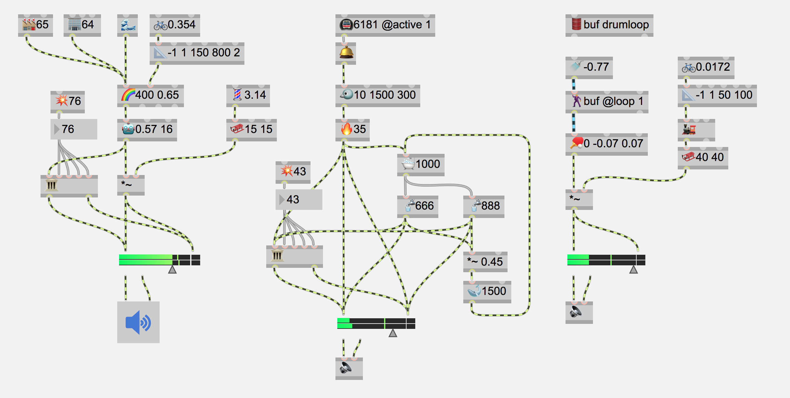

# emoji4max

Probably the least useful package for Max8, but lots of fun.

## Contribute

Suggestions for new objects with emoji are welcome. Suggestions for replacement of current emoji for a better fitting one as well. Feel free to fork this and adjust to your own preference also!

## Max

| object | emoji |
| - | - |
| anal | 📊 |
| append | ⏮ |
| bag | 💰 |
| bucket | 🗑 |
| buddy | 👫 |
| change | 🎭 |
| clocker | ⏰ |
| coll | 📋 |
| counter | 🎡 |
| ctlin | 🎛 |
| date | 🗓 |
| delay | ⌛️ |
| drunk | 🍺 |
| flush | 🚽 |
| gate | 🚦 |
| hi | 🕹 |
| iter | ✂️ |
| join | 📦 |
| key | ⌨️ |
| loadmess | 💥 |
| makenote | 🎵 |
| metro | 🚇 |
| mousestate | 🐭 |
| notein | 🎹 |
| noteout | 🎼 |
| onebang | 🎟 |
| peak | ⛰ |
| pgmout | 🎧 |
| pipe | ⏳ |
| prepend | ⏭ |
| print | 🖨 |
| prob | 🎰 |
| qmetro | 🚠 |
| random | 🎲 |
| select | 🔎 |
| serial | 📟 |
| speedlim | 🚫 |
| split | ⚖️ |
| swap | 🔄 |
| switch | 🚥 |
| timer | ⏱ |
| transport | 🔋 |
| trough | 🛤 |
| udpreceive | 🛰 |
| udpsend | 📡 |
| universal | 🌍 |
| unjoin | 🗃 |
| urn-jb | 🏺 |
| uzi | 🔫 |
| zl | 🛒 |

## MSP

| object | emoji |
| - | - |
| adc~ | 🎤 |
| adsr~ | 🎻 |
| biquad~ | 💪 |
| buffer~ | 🛢 |
| click~ | 🛎 |
| clip~ | 🗜 |
| count~ | 🏗 |
| cycle~ | 🚲 |
| dac~ | 🔈 |
| degrade~ | 🤖 |
| gate~ | 🕳 |
| groove~ | 💃 🕺 |
| index~ | 🗂 |
| line~ | 🎢 |
| lookup~ | 🔬 |
| noise~ | 🌪 |
| onepole~ | 🐋 |
| overdrive~ | 🔥 |
| peek~ | 👀 |
| phasor~ | 💈 |
| pink~ | 🌊 |
| play~ | 📻 |
| poke~ | 👉 |
| pong~ | 🏓 |
| rate~ | 🎚 |
| record~ | 💿 |
| rect~ | 🏢 |
| reson~ | 🐦 |
| saw~ | 🏭 |
| scale~ | 📐 |
| sig~ | 🚿 |
| slide~ | 🛷 |
| snapshot~ | 📷 |
| svf~ | 🌈 |
| tapin~ | 🛁 |
| tapout~ | 🚰 |
| teeth~ | 😬 |
| train~ | 🚂 |
| tri~ | 🏦 |
| wave~ | 🏄‍♀️  🏄‍♂️ |
| yafr2 | 🏛 |

# Inspiration

Inspired by the "Live Emojing" by Diego Dorado 

- https://diegodorado.com/en/works/live-emojing/
